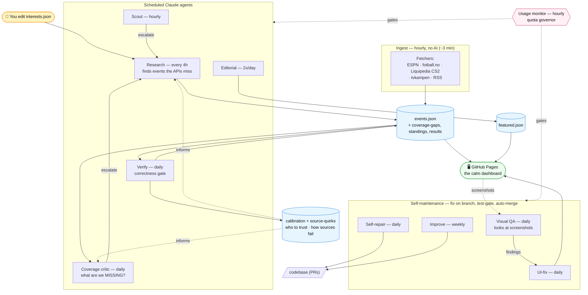

# SportSync

> A personal sports dashboard for a Norwegian sports fan — where **scheduled AI research
> agents** find, verify, and editorialize the events that static APIs miss.

[](https://github.com/CHaerem/SportSync/actions)
[](https://chaerem.github.io/SportSync/)

**See it live**: [chaerem.github.io/SportSync](https://chaerem.github.io/SportSync/)

<!-- STATUS:START -->
## AI-budsjett

Kvoten er **konto-bred** (delt med interaktiv Claude-bruk) — samlet kvote-trykk, ikke per-agent.

| Vindu | Brukt | Detaljer |
|---|---|---|
| Uke (7d) | **75%** 🟡 | ↑ +5pp siste 24t · nullstilles 2026-07-08 |
| Sesjon (5t) | 7% | nullstilles 20:50 UTC |
| Siste 7 dager | topp 75% · snitt 71% | 1t i sparemodus |

<sub>Oppdatert 2026-07-06 16:32 UTC av `usage-monitor` · kilde: `docs/data/usage-summary.json` · [Self-throttling on quota](#self-throttling-on-quota)</sub>
<!-- STATUS:END -->

## The idea

Sports APIs cover the big leagues. They miss most of what a Norwegian fan cares about:
biathlon world cups, Norway Chess, cross-country skiing, cycling stage races, Norwegian
Cup football, last-minute schedule changes. v1 of this project tried to close that gap
with an elaborate self-improving autonomy architecture (13 feedback loops, a nightly
multi-agent autopilot, 2000+ tests). It proved the concept — and produced stagnating
quality at high complexity.

**v2 bets on the model instead of the machinery**: nine scheduled Claude agents —
research, verify, editorial, scout, a coverage critic, a vision-based visual QA, a
UI-fix agent that self-heals rendering bugs (fix → verify → auto-merge), a
self-repair "mechanic" that fixes its own broken code/tests, and a weekly improve
agent that evolves its own behavior — do real research, write transparent JSON,
and explain their reasoning. The self-fixing loops auto-merge their own verified
changes (test-gated), stopping short only at three protected paths (workflows,
hooks, your interests file). Every loop is narrow and test-gated — the deliberate
opposite of v1's sprawling autopilot.

## Architecture

Everything runs on **GitHub Actions + Claude Code Max + GitHub Pages**. No servers,
no databases, no paid APIs.



**Reading it:** you own `interests.json`; the hourly static pipeline and the every-4h
research agent both write the shared board (`events.json`); scout and the coverage
critic nudge research toward what's missing; verify is the correctness gate and feeds a
trust layer (calibration + source-quirks) back into research and the critic; the board
plus the editorial brief publish to the calm dashboard; a self-maintenance ring
(visual-QA → UI-fix, self-repair, improve) keeps the code and UI healthy behind the test
gate; and the usage-monitor gates every agent on real quota.

### The scheduled jobs

| Job | When | Model | What it does |
|---|---|---|---|
| **Static pipeline** | hourly | — | Fetch ESPN · fotball.no · Liquipedia CS2 · tvkampen · RSS → `events.json`; auto-publish to Pages on change |
| **Research** | every 4h | Fable 5 → Opus 4.8 | Find events the APIs miss; append to `events.json`, rewrite `tracked.json` with a reason per entry |
| **Scout** | hourly | Haiku | Triage RSS + coverage gaps → escalate to research (max 2/day) |
| **Coverage critic** | daily | Opus | Audit what's missing — an imminent pass + a 4-week horizon, trusting no single source |
| **Verify** | daily | Opus | Re-check events against the web; log the calibration ledger + source-quirks |
| **Editorial** | 2×/day | Opus | Morning/evening brief → `featured.json` |
| **Visual QA** | daily | Sonnet | Screenshot the dashboard and *look* → flag truncation/overflow/calm-design |
| **UI-fix** | daily | Opus | Fix the frontend from QA findings → re-screenshot + test → auto-merge |
| **Self-repair** | daily | Opus | Fix broken runs/tests/fetchers → auto-merge |
| **Improve** | weekly | Opus | Mine the logs for one evidenced improvement → auto-merge |
| **Usage monitor** | hourly | — | Real account-wide quota gauge; gates every agent |

The self-fixing loops (UI-fix, self-repair, improve) auto-merge behind a re-run test
gate, stopping only at three **protected paths** that always wait for review:
`.github/workflows/**`, `scripts/hooks/**`, and `scripts/config/interests.json`.

### Correct "where to watch"

Getting the time and channel right is the whole point. Every followed event
resolves to a **Norwegian** channel (never FOX/ESPN): football matches match
against real [tvkampen.com](https://www.tvkampen.com) TV listings, with a
deterministic Norwegian-rights map (`scripts/lib/norwegian-rights.js`) as the
fallback. When the exact broadcaster isn't yet known (e.g. a World Cup match days
out), the UI shows one honest tentative `NRK / TV 2` label rather than guessing.

### Self-throttling on quota

Claude Code Max quota is finite and shared with interactive use, so the agents
watch it. A `usage-monitor` reads real account-wide usage — a minimal
`/v1/messages` call returns the `anthropic-ratelimit-unified-*` headers (5h + 7d
utilization + reset times) — writes `usage-state.json`, keeps an append-only
`usage-history.jsonl`, and rolls it into the trend shown in the **AI-budsjett**
block at the top of this README. Every agent gates on it: critical ones (research,
verify, scout) run unless the budget is nearly gone; nice-to-haves (editorial,
coverage-critic, visual-qa) step aside first when it runs low. Research also
prefers Fable 5 and auto-falls back to Opus 4.8 if Fable is unavailable. The
dashboard shows a quiet "AI-budsjett" line too. Fail-open by design — the governor
throttles only on fresh, confident quota data.

### Transparent tracking

- **`scripts/config/interests.json`** — the human's source of truth. AI never touches it.
- **`scripts/config/tracked.json`** — what the AI currently tracks. Every entry carries
  `reason`, `addedBy`, `evidence`, and an optional `expires` — inspectable on the
  dashboard under *"Hva vi følger"*.
- Every AI-researched event carries `confidence` (high requires 2+ source URLs) and an
  **AI badge** in the UI that opens the evidence.

### Portability

Vendor lock-in is confined to the nine agent workflow files
(`.github/workflows/*-agent.yml`, using `anthropics/claude-code-action@v1`). The
prompts in `scripts/agents/*.md` are capability-described — swap the AI provider by
replacing workflow YAML only.

## Frontend

Static PWA, no build step. **Calm design**: one quiet, scannable column (max 640px) —
no dashboard grid, no competing panels. A single day-grouped agenda where every row
answers only **when · what · where to watch**, with club crests / national flags and
always-Norwegian channels. Must-see events (favorite / Norwegian / high importance) get
the gentlest possible accent; details (standings, results, AI sources) are a tap away,
never in your face. Near-black dark default with a warm-paper light mode that follows the
system theme, live ESPN score polling (60s), one quiet editorial headline on top, tuned
to fit iPhone widths, installable on iOS/Android.

## Development

```bash
npm ci
npm run build      # fetch data + build events + calendar
npm run dev        # localhost:8000
npm test           # ~20 focused test files (~160 tests), <5s
npm run screenshot # Playwright visual check
```

See [CLAUDE.md](CLAUDE.md) for the full architecture reference.

## License

MIT License
